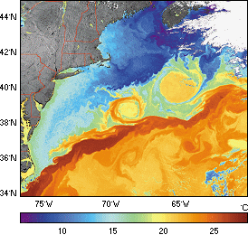
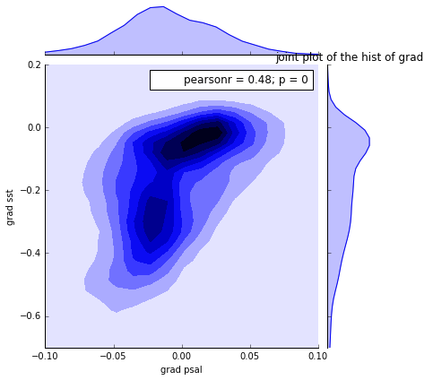
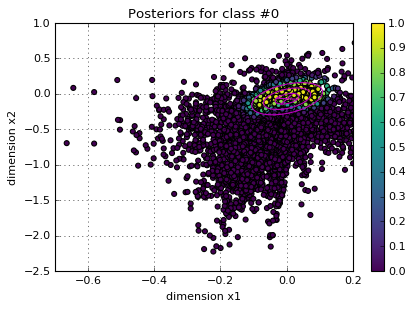
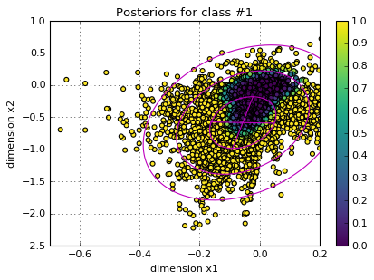
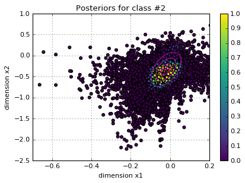
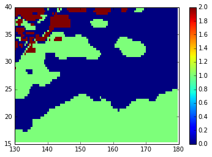

# Exploring any relation between SST & PSAL in the Kuroshio gulf region 

In this work we attempt to look for any correlation between sea surface temperature (SST) and Salinity (PSAL) for the Kuroshio gulf region.

## Procedure

* Dataset used: ISAS15 dataset ([source](https://github.com/obidam/m2poc2018/tree/master/projects))

* Use the unsupervised Gaussian Mixture Model to fit and predict cluster. For this we specify we are looking for **3 clusters**, one for each of the two main clusters identified in the joint plot of the conditional probabilities and one as a `trash cluster` for the rest of the points.
* ​

## Results

A correlation between SST and PSAL was identified from the conditional probabilities as shown in the following joint plot:

Below are the three identified clusters:

The following map shows the most frequent cluster/label (**0**)

